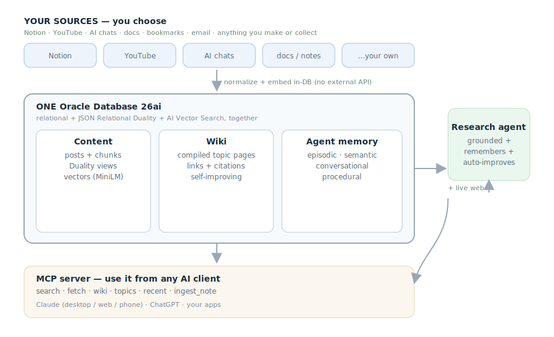

# Build a Second Brain on Oracle Database 26ai

*A self-improving research agent grounded in **your own sources** — the data, its embeddings, and
the agent's memory all living in one database.*

---

Everything you make or collect scatters — across apps that each remember a little and forget the
rest. Your notes live in one place, your research in another, the long AI chats where the real
thinking happened in a third, and the assistant you ask for help has no idea about any of them.

This tutorial builds the fix: a **second brain** — one place that holds *your* stuff, searchable
by *meaning*, with an agent that researches on top of it and **remembers what it learned**.
**You choose the sources** — point it at Notion, your videos, your AI chats, docs, bookmarks,
whatever matters for your use case (content, research, work knowledge, a personal wiki). The build
is the same; only the sources change.

We'll build it on **Oracle Database 26ai**, and the reason that matters is simple: one engine does
relational data, JSON documents, **AI Vector Search**, and even runs the embedding model **inside
the database** — so there's far less glue code, and your data, its meaning, and the agent's memory
all live together.

By the end you'll have a working research agent you can ask *"what do I know about X, and what's
new this week?"* — and watch it get sharper every time you use it.



> Full, runnable code: **[github.com/LindaHaviv/second-brain](https://github.com/LindaHaviv/second-brain)**.
> Everything runs **locally and headless** first (no cloud account needed); going to Oracle Cloud
> is an optional last step.

**Who this is for / what you need:** any developer comfortable with a terminal — **no prior Oracle
experience required.** You'll need a Mac with [Homebrew](https://brew.sh), Python 3.12, and ~20
minutes. The quickstart spins up the database in a container and loads a public sample channel, so
you watch the whole thing work *before* pointing it at your own data.

## The shape of it

> **📌 Pick your sources.** The system is *collector-agnostic* — it only needs your stuff as rows
> in one `posts` table. This build ships loaders for **Notion** (pages/databases), **YouTube**
> (videos + transcripts), **AI chats** (Claude/ChatGPT exports), and **Claude Code** sessions —
> but a docs folder, bookmarks, or an email export work the same way. Map each source's fields to
> `title`, `text`, `url`, `published_at`; the embedding is generated in-DB on insert. Swap sources
> for your use case (content, research, work, a personal wiki) without touching anything downstream.

> **🔒 Redact as you ingest.** Some sources — especially AI-chat and coding-session transcripts —
> can contain API keys or tokens. Scrub secret patterns *before* they land in the database (the
> repo does this on ingest, and ships a `review.py` that scans for anything that slipped through).

Three layers, **one database**:
1. **Content** — everything you've made, as rows you can read back as JSON documents.
2. **A compiled wiki** — synthesized topic pages over that content (self-maintaining).
3. **Agent memory** — what the agent has learned, in all four flavors.

Let's build each.

## 1. Store content — normalized, read as documents (JSON Relational Duality)

Store your content in clean relational tables, but read and write it as a single JSON
*document* — no ORM, no dual-writes, no sync code. That's **JSON Relational Duality**, and it's
the differentiator: governed relational data *and* document ergonomics from the same table.

```sql
CREATE TABLE posts (
  post_id       NUMBER GENERATED BY DEFAULT AS IDENTITY PRIMARY KEY,
  platform_id   VARCHAR2(20) NOT NULL,
  kind          VARCHAR2(20) DEFAULT 'post',     -- post | reel | video | article | tweet
  title         VARCHAR2(1000),
  caption       CLOB,
  content_embedding VECTOR(384, FLOAT32)         -- semantic search, in-DB (more below)
);

-- one "post" served as a document, its platform + media nested, fully read/write:
CREATE OR REPLACE JSON RELATIONAL DUALITY VIEW post_dv AS
  posts @insert @update @delete {
    _id : post_id   title : title   caption : caption   kind : kind
    platform : platforms { name : display_name }
    media    : media [ { url : url  kind : kind } ]
  };
```

Now your app reads `post_dv` as JSON and the database keeps the relational tables consistent.

## 2. Search by meaning — vectors *and the embedding model* in the database

To search by meaning you need embeddings. With **26ai you don't call an external embedding
API** — you load a small ONNX model (MiniLM) *into the database* once and generate embeddings in
SQL:

```sql
-- load the model once (from a local file as a BLOB, or from object storage)
EXEC DBMS_VECTOR.LOAD_ONNX_MODEL('DATA_PUMP_DIR', 'all_MiniLM_L12_v2.onnx', 'MINILM', ...);
```

Then semantic search is just SQL — embed the query and rank by cosine distance:

```sql
SELECT title, caption
FROM   posts
ORDER  BY VECTOR_DISTANCE(content_embedding,
                          VECTOR_EMBEDDING(MINILM USING :q AS DATA), COSINE)
FETCH FIRST 5 ROWS ONLY;
```

No embedding service, no keys, no data leaving the database. We also chunk long content
(transcripts, chats) into a `content_chunks` table so a query lands on the right *passage*, not
just the right item — and search ranks items and passages together.

> **📸 Screenshot:** one query returning all three levels at once — a synthesized **wiki** page,
> the matching **item**, and the exact **passage** inside a long transcript.

## 3. The research agent — and four kinds of memory

Here's the agent you came for. It's a small, transparent loop (Claude + tools) — the database
does the heavy lifting. Its tools: search your content, read a post, read a wiki page, and search
the live web. It grounds claims about *your* work in *your* content and uses the web for what's
current.

What makes it a **second brain** rather than a search box is **memory** — and we model all four
types the agent-memory literature talks about, each as a table in the same database:

| Memory | Table | What it holds |
|---|---|---|
| **Episodic** | `agent_memory` | every past research run (question, outcome, sources, lesson) |
| **Semantic** | `semantic_memory` | durable facts distilled from those runs |
| **Conversational** | `conversations` | the current multi-turn context |
| **Procedural** | `procedural_memory` | the agent's tools, ranked by what works |

Before answering, the agent **recalls** relevant past runs and learned facts. After answering, it
**records** the run. And periodically it **consolidates** episodic memory into semantic facts —
distilling "what happened" into "what I now know about this creator." That's the self-improving
loop:

```
 answer  →  record the run  →  recall + consolidate  →  answer better next time
```

The more you use it, the more it knows your themes, your recurring questions, your patterns, and
your gaps — and it stops re-deriving them every time. (In the repo this runs automatically every
few research runs, plus a daily scheduled consolidation.)

> **📸 Screenshot:** the agent answering a question with citations to your own sources, then a
> follow-up where it visibly builds on the previous turn — and the `agent_memory` count ticking up.

## 4. A self-improving knowledge wiki (the Duality + relational showcase)

RAG re-synthesizes your knowledge on every question. We add a layer that **compiles it once**: an
LLM reads your content and writes synthesized **topic pages** — cross-linked, citing the source
posts — that improve as you add content. It's the strongest Oracle showcase in the build, because
a wiki page is *both* a document *and* a graph:

- `wiki_pages` — the page (a JSON document **+** a vector embedding)
- `page_links` — page → page cross-links (**relational** graph)
- `page_sources` — citations back to your `posts` (**relational**)
- `wiki_page_dv` — a **Duality view** that serves a page as one JSON document with its citations
  nested

So a single page exercises **relational + JSON Relational Duality + AI Vector Search** at once,
and the agent answers from your *synthesized* knowledge, tracing every claim back to a real video
or note.

## 5. Use it from anywhere — MCP

Finally, make the brain a tool any AI client can call. A small **MCP server** exposes the standard
`search`/`fetch` connector contract — the same shape **Claude *and* ChatGPT** expect — plus
`wiki`, `topics`, `recent`, and `ingest_note`, so you can open Claude (or ChatGPT) and ask
*"search my brain for what I've covered on AI inference"* and it answers from your own content.
Run it **locally over stdio** (Claude Desktop / Claude Code), or **host it** (HTTP) so it's
reachable from **claude.ai on your phone and ChatGPT** too. Hosting puts your brain on the public
internet, though — so lock it down (see security, below).

> **📸 Screenshot:** asking Claude *"search my brain for …"* — on your phone — and it answering
> from your own sources, the brain showing up as a connector.

## Going to the cloud (optional)

Everything above runs locally. When you want it always-on and backed up, lift it to **Oracle
Autonomous Database** — same engine, managed. The app connects over a wallet with **no code
changes**; you load the same ONNX model, copy the data, and you're running in the cloud.

## Keep it private — security (don't skip this)

Your brain holds *your* data, so treat it that way. The repo bakes these in; if you fork it, keep
them on:

- **Redact before you ingest.** AI-chat and coding transcripts leak API keys — scrub secret
  patterns *before* they hit the database. A `review.py` scans for anything that slipped through.
- **Never commit secrets.** `.env`, the cloud wallet, and your raw content are gitignored — keep
  them that way; keep the real copies in a password manager, and rotate anything that's exposed.
- **Least privilege, no public database.** The app runs as a limited DB user (not admin), and the
  database is *never* exposed to the internet — only the MCP server talks to it.
- **Lock the front door if you host it.** A public MCP needs auth on *every* request. For
  claude.ai/ChatGPT that means **OAuth + an allowlist** — so even after a valid login, only *your*
  account is authorized; everyone else is denied, and the server **refuses to start** with an empty
  allowlist.
- **Treat retrieved content as data, not instructions** (prompt-injection), and keep any
  write/update tools **human-approved**.

Full checklist: **[SECURITY.md](https://github.com/LindaHaviv/second-brain/blob/main/SECURITY.md)**.

## What you end up with

One database that holds your content, its meaning, your synthesized knowledge, and an agent's
growing memory — and an assistant that researches over all of it and improves with use. Not a
pile of notes you have to re-read, but a brain that gets better the more you make.

Clone it, point it at your own content, and ask it something only *you* would know the answer to.

> Code + step-by-step setup: **[github.com/LindaHaviv/second-brain](https://github.com/LindaHaviv/second-brain)** →
> start with `docs/TUTORIAL.md`.
